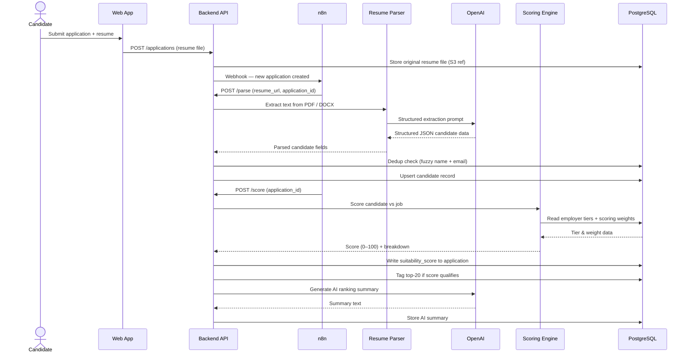
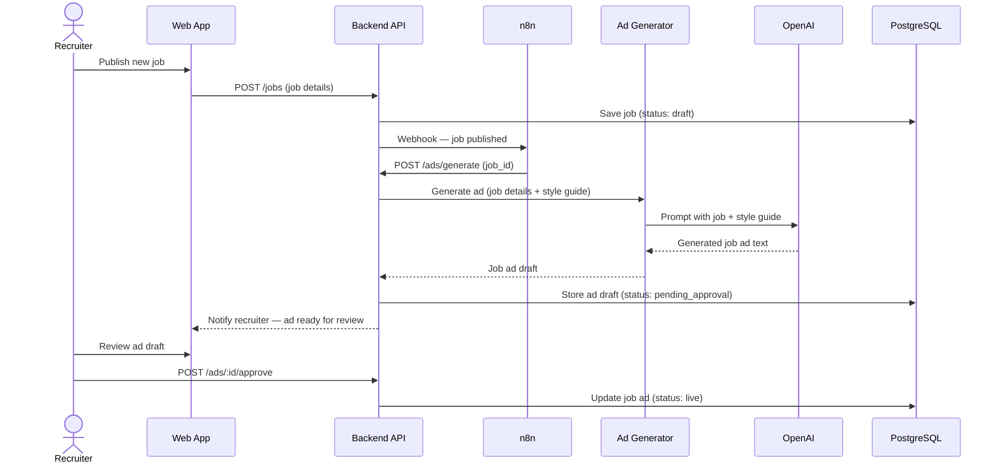
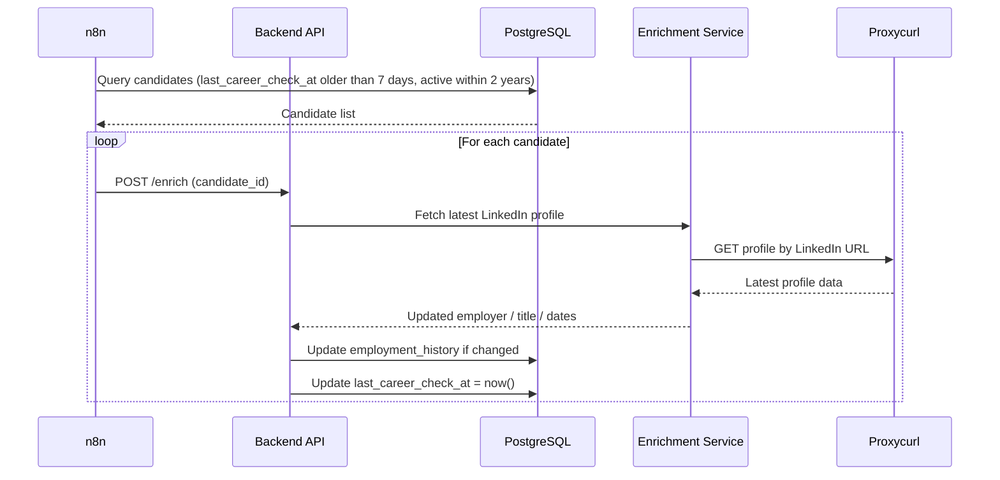

# ARCHITECTURE.md — AI Recruitment Platform

C4 architecture diagrams for the multi-tenant AI-powered recruitment automation platform.

---

## Level 1 — System Context

```
  ┌──────────────┐   ┌──────────────┐   ┌──────────────┐
  │ Recruiter    │   │  Candidate   │   │ Super Admin  │
  │ (Agency /    │   │ (Applicant)  │   │  (Platform   │
  │ IT Company)  │   │              │   │   Owner)     │
  └──────┬───────┘   └──────┬───────┘   └──────┬───────┘
         │                  │                  │
         └──────────────────┼──────────────────┘
                            │ HTTPS
               ┌────────────▼──────────────────┐
               │    AI Recruitment Platform    │
               │      (Multi-tenant SaaS)      │
               │                               │
               │  • Resume parsing & scoring   │
               │  • AI job ad generation       │
               │  • LinkedIn enrichment        │
               │  • ATS pipeline management    │
               └──┬──────────┬──────────┬──────┘
                  │          │          │
                  ▼          ▼          ▼
     ┌────────────────┐  ┌────────┐  ┌────────────────┐
     │  OpenAI API    │  │   S3   │  │ Proxycurl/PDL  │
     │  (GPT-4o LLM)  │  │Storage │  │ (LinkedIn)     │
     └────────────────┘  └────────┘  └────────────────┘

  ┌─────────────────────────────────────────────────────┐
  │  n8n (self-hosted)  ──Webhooks──►  Platform above   │
  └─────────────────────────────────────────────────────┘
```

---

## Level 2 — Container Diagram

```
  ┌──────────────────────────────────────────────────────────┐
  │                  AI Recruitment Platform                 │
  │                                                          │
  │  ┌────────────────────────────────────────────────────┐  │
  │  │  Web App  (Next.js)                                │  │
  │  │  Recruiter & Candidate UI, job forms, workspace    │  │
  │  └──────────────────────┬─────────────────────────────┘  │
  │                         │ REST / JSON                    │
  │  ┌──────────────────────▼─────────────────────────────┐  │
  │  │  Backend API  (FastAPI)                            │  │
  │  │  Auth · ATS · Parse · Score · AdGen · Enrich       │  │
  │  └───┬─────────┬─────────┬────────┬───────────────────┘  │
  │      │         │         │        │                      │
  │  ┌───▼───┐ ┌───▼───┐ ┌───▼──┐ ┌───▼──────────┐           │
  │  │Resume │ │Score  │ │ Job  │ │  LinkedIn    │           │
  │  │Parser │ │Engine │ │  Ad  │ │  Enrichment  │           │
  │  │  Svc  │ │       │ │ Gen  │ │  Service     │           │
  │  └───┬───┘ └───┬───┘ └───┬──┘ └───┬──────────┘           │
  │      └─────────┴─────────┴────────┘                      │
  │                          │                               │
  │  ┌───────────────────────▼───────────────────────────┐   │
  │  │  Data Layer                                       │   │
  │  │  ┌─────────────────────────┐  ┌─────────────────┐ │   │
  │  │  │  PostgreSQL + pgvector  │  │  S3 File Store  │ │   │
  │  │  │  candidates · jobs      │  │  resumes · docs │ │   │
  │  │  │  scores · embeddings    │  │                 │ │   │
  │  │  └─────────────────────────┘  └─────────────────┘ │   │
  │  └───────────────────────────────────────────────────┘   │
  │                                                          │
  │  ┌────────────────────────────────────────────────────┐  │
  │  │  n8n Automation Engine  (self-hosted)              │  │
  │  │  Crons · Webhooks · Parse · Score · Enrich flows   │  │
  │  └────────────────────────────────────────────────────┘  │
  └──────────────────────────────────────────────────────────┘

  External APIs
  ┌──────────────────┐   ┌──────────────────┐
  │  OpenAI GPT-4o   │   │  Proxycurl / PDL │
  └──────────────────┘   └──────────────────┘
```

---

## Level 3 — Component Diagram: Backend API

```
  ┌──────────────────────────────────────────────────────────┐
  │                   Backend API  (FastAPI)                 │
  │                                                          │
  │  ┌────────────────────────┐  ┌────────────────────────┐  │
  │  │     Auth Module        │  │       ATS Module       │  │
  │  │  JWT · Tenant RBAC     │  │  Jobs · Candidates     │  │
  │  │  Role-based access     │  │  Applications · Stages │  │
  │  └────────────────────────┘  └────────────────────────┘  │
  │                                                          │
  │  ┌──────────────┐  ┌──────────────┐  ┌───────────────┐   │
  │  │    Parse     │  │    Score     │  │  Ad Generator │   │
  │  │  Controller  │  │  Controller  │  │  Controller   │   │
  │  │              │  │              │  │               │   │
  │  │ • Upload     │  │ • Trigger    │  │ • Request ad  │   │
  │  │   resume     │  │   scoring    │  │   generation  │   │
  │  │ • Call       │  │ • Write      │  │ • Store draft │   │
  │  │   parser     │  │   score +    │  │ • Approve     │   │
  │  │ • Persist    │  │   breakdown  │  │   workflow    │   │
  │  └──────┬───────┘  └──────┬───────┘  └───────────────┘   │
  │         │                 │                              │
  │  ┌──────▼───────┐  ┌──────▼───────┐  ┌───────────────┐   │
  │  │    Dedup     │  │  Shortlist   │  │  Enrichment   │   │
  │  │   Service    │  │   Module     │  │  Controller   │   │
  │  │              │  │              │  │               │   │
  │  │ Fuzzy match  │  │ Tag top-20   │  │ On-demand /   │   │
  │  │ name + email │  │ AI rank      │  │ Cron lookup   │   │
  │  │ before save  │  │ summary      │  │ LinkedIn URL  │   │
  │  └──────────────┘  └──────────────┘  └───────────────┘   │
  │                                                          │
  │  ┌────────────────────────────────────────────────────┐  │
  │  │               Employer Tier Sync                   │  │
  │  │   Excel upload → parse → upsert employer_tiers     │  │
  │  └────────────────────────────────────────────────────┘  │
  └──────────────────────────────────────────────────────────┘
```

---

## Workflow Sequences

### 1. Resume Submission → Score → Shortlist



---

### 2. Job Ad Generation



---

### 3. LinkedIn Enrichment — Weekly Cron



---

## Infrastructure Overview

```
  ┌──────────────────────────────────────────────────────────┐
  │                    Cloud  (AWS / GCP)                    │
  │                                                          │
  │  ┌──────────────────────────────────────────────────┐    │
  │  │  Frontend Layer                                  │    │
  │  │  ┌────────────────────┐                          │    │
  │  │  │  Next.js  Web App  │                          │    │
  │  │  └────────────────────┘                          │    │
  │  └──────────────────────────────────────────────────┘    │
  │                        │ REST                            │
  │  ┌─────────────────────▼────────────────────────────┐    │
  │  │  Backend Layer                                   │    │
  │  │  ┌──────────┐  ┌──────────┐  ┌──────────────┐    │    │
  │  │  │ FastAPI  │  │ Resume   │  │  AI Scoring  │    │    │
  │  │  │   API    │  │  Parser  │  │   Engine     │    │    │
  │  │  └──────────┘  └──────────┘  └──────────────┘    │    │
  │  │  ┌──────────────────┐  ┌──────────────────────┐  │    │
  │  │  │  Ad Gen Service  │  │  Enrichment Service  │  │    │
  │  │  └──────────────────┘  └──────────────────────┘  │    │
  │  └──────────────────────────────────────────────────┘    │
  │                                                          │
  │  ┌──────────────────────────────────────────────────┐    │
  │  │  Data Layer                                      │    │
  │  │  ┌──────────────────────┐  ┌──────────────────┐  │    │
  │  │  │  PostgreSQL+pgvector │  │   S3  Storage    │  │    │
  │  │  └──────────────────────┘  └──────────────────┘  │    │
  │  └──────────────────────────────────────────────────┘    │
  │                                                          │
  │  ┌──────────────────────────────────────────────────┐    │
  │  │  Automation Layer                                │    │
  │  │  ┌──────────────────────┐                        │    │
  │  │  │  n8n  (self-hosted)  │                        │    │
  │  │  └──────────────────────┘                        │    │
  │  └──────────────────────────────────────────────────┘    │
  └──────────────────────────────────────────────────────────┘
                             │
         ┌───────────────────┴───────────────────┐
         │           External  APIs              │
         │  ┌──────────────┐  ┌───────────────┐  │
         │  │ OpenAI GPT-4o│  │ Proxycurl/PDL │  │
         │  └──────────────┘  └───────────────┘  │
         └───────────────────────────────────────┘
```
